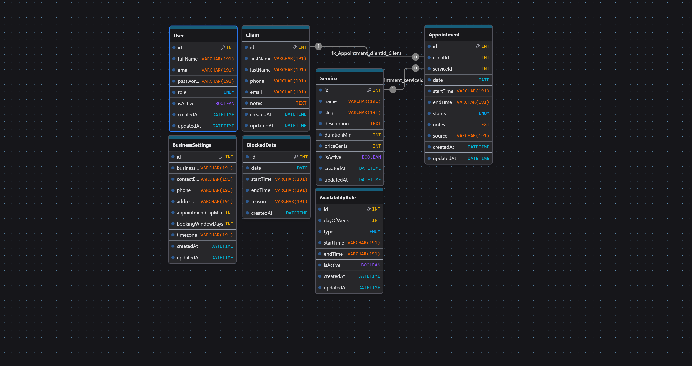

# Plataforma de Podologia - Arquitectura Base

## 1. Arquitectura general

Se propone un monorepo simple con dos aplicaciones desacopladas:

- `frontend/`: React + Vite + Tailwind + React Router para sitio publico, reservas y panel admin.
- `backend/`: Node.js + Express + Prisma + MySQL + JWT para API REST y reglas de negocio.

### Principios

- Separacion clara entre UI, API y persistencia.
- Arquitectura modular por dominio.
- Preparado para evolucionar a SaaS multi-negocio.
- Reutilizacion de componentes, esquemas y utilidades.
- Reglas de negocio concentradas en servicios del backend.

### Vision SaaS futura

La base queda lista para introducir mas adelante:

- `tenantId` en entidades de negocio.
- aislamiento por negocio/clinica.
- integraciones desacopladas en `integrations/` y `jobs/`.
- colas/eventos para recordatorios y sincronizaciones.

## 2. Referencia visual tomada del sitio actual

Se conserva y profesionaliza:

- paleta rosa empolvado + neutros calidos.
- tipografia elegante para titulos y sans moderna para texto.
- tono cercano, sanitario y profesional.
- CTA principal a reserva/WhatsApp.
- flujo: Home -> servicios -> confianza -> FAQ -> contacto -> reserva.

## 3. Estructura de carpetas

```text
frontend/
  public/
    images/
  src/
    app/
    components/
      admin/
      booking/
      common/
      home/
      layout/
      ui/
    data/
    hooks/
    layouts/
    lib/
    pages/
      admin/
      public/
    routes/
    services/
    utils/
  .env.example
  index.html
  package.json
  postcss.config.js
  tailwind.config.js
  vite.config.js

backend/
  prisma/
    schema.prisma
    seed.js
  src/
    config/
    constants/
    integrations/
    jobs/
    middleware/
    modules/
      appointments/
      auth/
      availability/
      business-settings/
      clients/
      services/
      users/
    routes/
    utils/
    app.js
    server.js
  .env.example
  package.json
```

## 4. Modelo de base de datos

Entidades principales:

- `users`
- `clients`
- `services`
- `appointments`
- `availability_rules`
- `blocked_dates`
- `business_settings`

Diagrama recomendado:

- Exportar el modelo desde `drawdb.app` como PNG y guardarlo en `docs/diagrams/db-diagram.png`.
- Referencia de carpeta: [docs/diagrams/README.md](/c:/Users/Emula/Desktop/proyecto%20podologia/docs/diagrams/README.md)

Vista embebida:



## 5. Endpoints REST propuestos

### Auth

- `POST /api/auth/login`
- `GET /api/auth/me`

### Users

- `GET /api/users`
- `POST /api/users`

### Clients

- `GET /api/clients`
- `POST /api/clients`
- `GET /api/clients/:id`
- `PATCH /api/clients/:id`

### Services

- `GET /api/services`
- `POST /api/services`
- `PATCH /api/services/:id`
- `DELETE /api/services/:id`

### Availability

- `GET /api/availability/slots?serviceId=&date=YYYY-MM-DD`
- `GET /api/availability/rules`
- `POST /api/availability/rules`
- `PATCH /api/availability/rules/:id`
- `DELETE /api/availability/rules/:id`
- `GET /api/availability/blocked-dates`
- `POST /api/availability/blocked-dates`
- `DELETE /api/availability/blocked-dates/:id`

### Appointments

- `GET /api/appointments`
- `POST /api/appointments`
- `GET /api/appointments/:id`
- `PATCH /api/appointments/:id`
- `PATCH /api/appointments/:id/status`
- `PATCH /api/appointments/:id/reschedule`
- `DELETE /api/appointments/:id`

### Business settings

- `GET /api/business-settings`
- `PATCH /api/business-settings`

## 6. Flujo funcional de reserva

1. Home y exploracion de servicios.
2. Seleccion de servicio y fecha.
3. Consulta de slots reales.
4. Carga de datos del cliente.
5. Validacion de reglas, bloqueos y solapamientos.
6. Creacion de cliente y turno.
7. Confirmacion visual y CTA complementario a WhatsApp.

## 7. Flujo funcional del panel admin

1. Login con JWT.
2. Dashboard con metricas y agenda.
3. Gestion de turnos.
4. Gestion de servicios.
5. Configuracion de disponibilidad y bloqueos.

## 8. Roadmap sugerido

### Etapa 1

- Arquitectura base.
- Home publico.
- API de autenticacion.
- CRUD de servicios.
- motor de disponibilidad.
- reserva de turnos.

### Etapa 2

- Dashboard admin real.
- filtros avanzados.
- email y WhatsApp transactional.
- auditoria y logs.

### Etapa 3

- multi-tenant SaaS.
- roles y permisos.
- calendario semanal.
- sincronizacion con Google Calendar.
- bots e integraciones.
